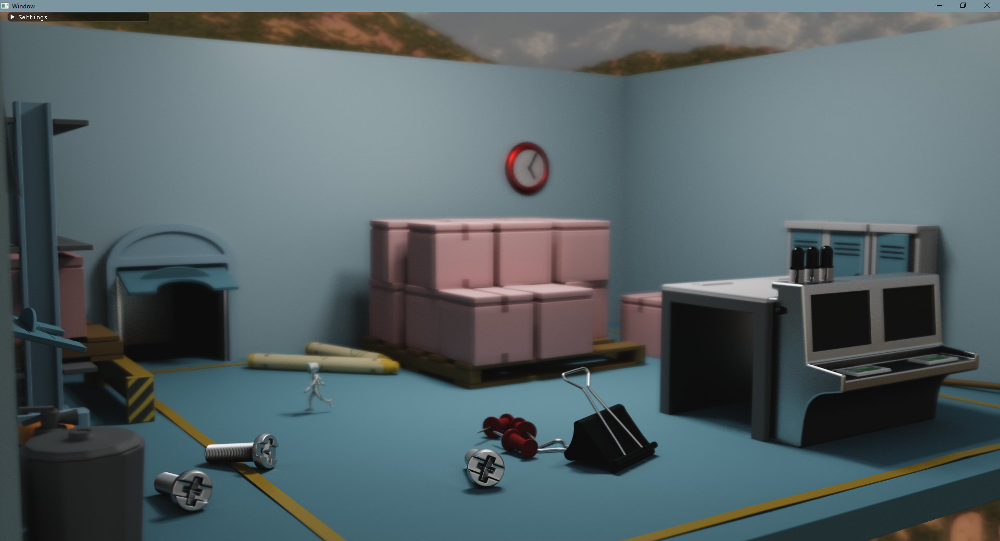

# Rendering FW

A rendering framework inspired by [lighthouse2](https://github.com/jbikker/lighthouse2). This framework
uses a very similar architectural design, but was re-implemented from the ground up. The Vulkan RTX core
for lighthouse2 was developed by [me](https://github.com/MeirBon) and the Vulkan RTX renderer in this
project shares most of its code with the Vulkan RTX rendercore of lighthouse2.

## Features
- Overall performance-oriented renderers
- gLTF with animations
- Anything Assimp supports including animation through file formats like Collada and FBX
- Dynamic lighting, point lights, spot lights, directional lights & area lights

## Available renderers:
- Vulkan RTX path tracer
- OptiX 6.5 RTX path tracer
- OpenGL Renderer

## WIP Renderers
- CPU path tracer using Embree

## Planned renderers:
- Vulkan PBR Rasterizer
- Metal path tracer using Apple's ray-tracing framework 
