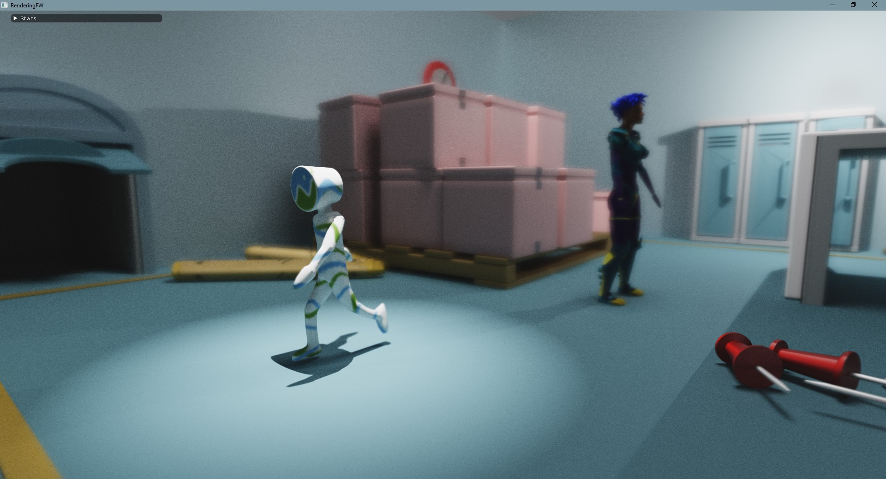
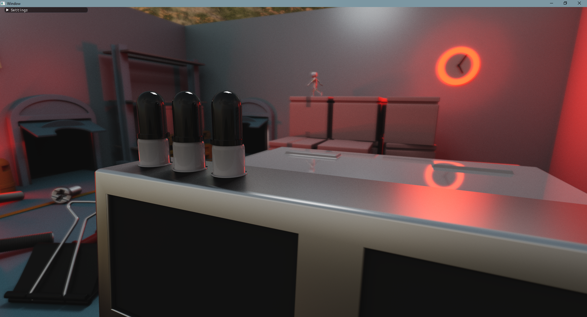

# Rendering FW

A rendering framework inspired by [lighthouse2](https://github.com/jbikker/lighthouse2). This framework
uses a very similar architectural design, but was re-implemented from the ground up. The Vulkan RTX core
for lighthouse2 was developed by [me](https://github.com/MeirBon) and the Vulkan RTX renderer in this
project shares most of its code with the Vulkan RTX rendercore of lighthouse2.

## Building
This project requires the following dependencies:
- OpenGL, version >=3.3 for any non-Vulkan based renderers, >= 4.5 for Vulkan based renderers (for interop)
- [GLEW](http://glew.sourceforge.net/)
- [OptiX 6.5 (included)](https://developer.nvidia.com/optix)
- [OptiX 7.0 (included)](https://developer.nvidia.com/optix)
- [GLFW 3.3](https://github.com/glfw/glfw)
- [FreeImage](http://freeimage.sourceforge.net/)
- [Vulkan-Memory-Allocator](https://github.com/GPUOpen-LibrariesAndSDKs/VulkanMemoryAllocator)
- [Assimp](https://github.com/assimp/assimp)
- [Embree](https://github.com/embree/embree)
- [Cpp-Taskflow](https://github.com/cpp-taskflow/cpp-taskflow)
- [Vulkan SDK](https://www.lunarg.com/vulkan-sdk/)

I recommend using [vcpkg](https://github.com/microsoft/vcpkg) as it can provide all the libraries listed above.
To install the dependencies for this project, run: `vcpkg install glew glfw3 freeimage vulkan-memory-allocator assimp embree3 cpp-taskflow` after installing vcpkg.
This project has only been tested on 64 bit platforms. You may be able to get certain renderers working on 32 bit architectures but it is not guarenteed.

## Features
- Overall performance-oriented renderers
- gLTF with animations
- Anything Assimp supports including animation through file formats like Collada and FBX
- Dynamic lighting, point lights, spot lights, directional lights & area lights

## Available renderers:
- Vulkan RTX path tracer
- OptiX 6.5 RTX path tracer
- OpenGL Renderer
- CUDA (non-RTX) Path tracer

## WIP Renderers
- CPU path tracer using Embree

## Planned renderers:
- Vulkan PBR Rasterizer
- Metal path tracer using Apple's ray-tracing framework 

## Frequent problems
- If you're running Linux/MacOS and a renderer cannot open/find a specific
shared library, set `LD_LIBRARY_PATH=.` as an environment variable on launch.
- On initial launch, the framework will log 'Camera file "camera.bin" does not exist'.
This is expected as the file indeed does not (yet) exist. The camera gets saved once the
program exits and gets loaded back in when relaunching the framework. If the file does not exist,
a camera with default parameters gets loaded.
